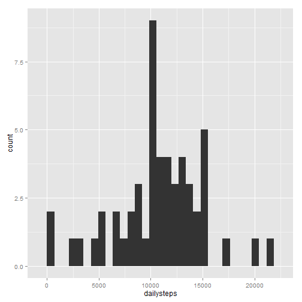
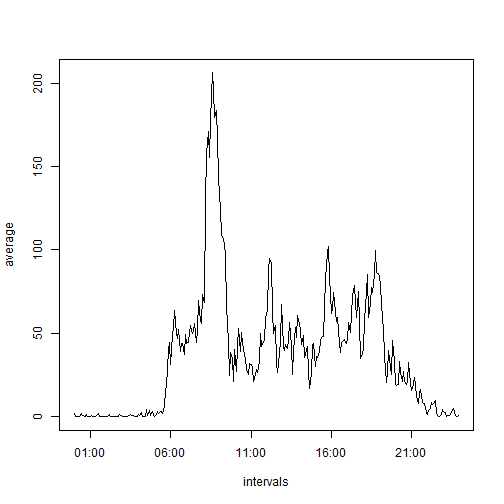
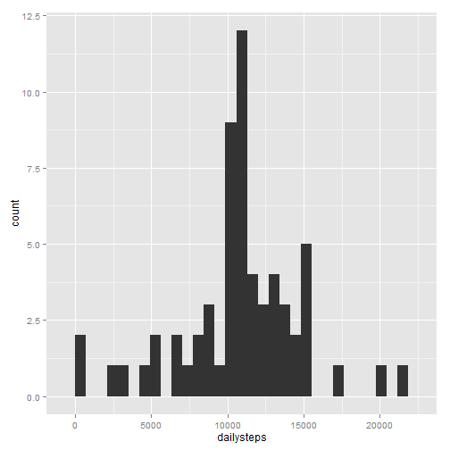

## Loading and preprocessing the data

Dataset: [Activity monitoring data](https://d396qusza40orc.cloudfront.net/repdata%2Fdata%2Factivity.zip) [52K]

The variables included in this dataset are:

* **steps**: Number of steps taking in a 5-minute interval (missing
    values are coded as `NA`)

* **date**: The date on which the measurement was taken in YYYY-MM-DD
    format

* **interval**: Identifier for the 5-minute interval in which
    measurement was taken

Loading the .csv data from the working directory:


```r
activity<-read.csv("activity.csv")
```

Changing data into the format of the dplyr package (requires installed dplyr package):


```r
library(dplyr)
activity<-tbl_df(activity)
```

## What is mean total number of steps taken per day?

Calculating the total number of steps taken per day:


```r
total<-activity %>% group_by(date) %>% summarize(dailysteps=sum(steps))
```

Creating the histogram with the total number of steps per day (requires ggplot2 package):


```r
library(ggplot2)
qplot(dailysteps,data=total,geom="histogram")
```

 


The mean of the total daily steps is:


```r
mean(total$dailysteps, na.rm=TRUE)
```

```
## [1] 10766.19
```

The median of the total daily steps is:


```r
median(total$dailysteps,na.rm=TRUE)
```

```
## [1] 10765
```


## What is the average daily activity pattern?

Transforming the interval variable and creating a time series plot of the 5-minute interval (x-axis) and the average number of steps taken, averaged across all days (y-axis):


```r
average<-activity %>% group_by(interval) %>% summarize(average=mean(steps,na.rm=TRUE))
average$intervals<-strptime(sprintf("%04d",as.numeric(average$interval)), format="%H%M")
with(average,plot(intervals, average, type="l"))
```

 

## Imputing missing values

The total number of missing values in the dataset:


```r
sum(is.na(activity$steps))
```

```
## [1] 2304
```


Filling in all of the missing values in the dataset with the mean for that 5-minute interval:


```r
fill_activity <- activity
index_na <- which(is.na(activity$steps)) 
for (i in index_na) {
    fill_activity$steps[i] <- with(average, 
                                  average[interval == fill_activity$interval[i]])}
```

Calculating the total number of steps taken per day:


```r
total_fill<-fill_activity %>% group_by(date) %>% summarize(dailysteps=sum(steps))
```

Creating the histogram with the total number of steps per day (requires ggplot2 package):


```r
qplot(dailysteps,data=total_fill,geom="histogram")
```

 

The mean of the total daily steps is:


```r
mean(total_fill$dailysteps, na.rm=TRUE)
```

```
## [1] 10766.19
```

The median of the total daily steps is:


```r
median(total_fill$dailysteps,na.rm=TRUE)
```

```
## [1] 10766.19
```

Filling in the missing values of the steps variable, and substituting them with the 5 minute interval averages changed the median towards the mean. The histogram also changed with the added occurances on the days where missing values were appearing before.

## Are there differences in activity patterns between weekdays and weekends?

I just started a new job, and I am super tired. This plot is just missing from here. Cheers and thanks for your contributions so far.
